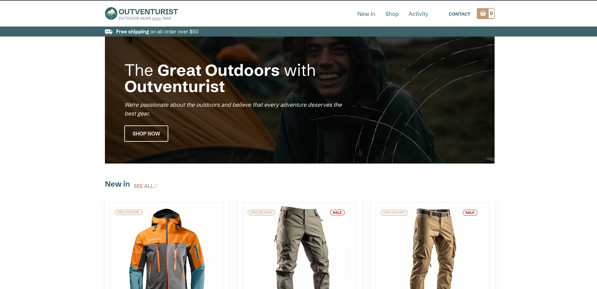

<h2><strong>Outventurist</strong></h2>
<br >

<hr >

<h4>Description</h4>
We're passionate about the outdoors and <br >
believe that every adventure deserves the best gear.
<br >

<h4>Installation Guide</h4>
I'll assume you already have <strong>Node</strong> installed.

Start by cloning the repo:

```
https://github.com/bismarkboateng/OUTVENTURIST.git
cd OUTVENTURIST
yarn
yarn dev
```

select the link running on your development server to preview<br>
the application